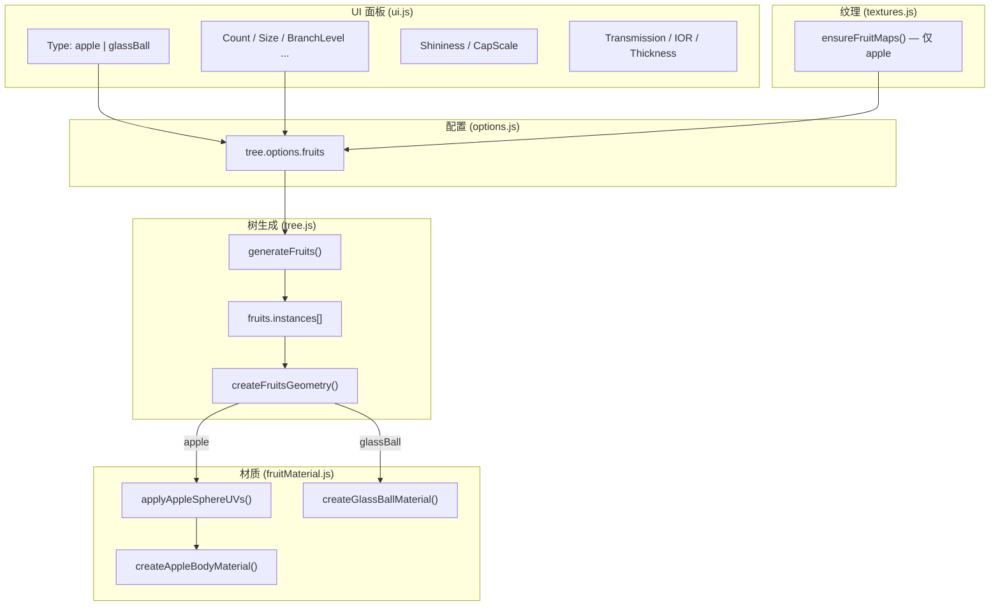

# 树上挂苹果还是挂玻璃球？Three.js 程序化果实的完整实现指南

> 基于 EZ-Tree 扩展：从扫描贴图苹果到物理玻璃球，一套 InstancedMesh 架构搞定两种风格。

---

## 前言：为什么这件事比「加个 Sphere」难得多？

我在一个 **Three.js 程序化树** 项目里做挂果功能，一开始想法很简单：

> 分支上 `new SphereGeometry`，贴一张苹果图，完事。

结果踩了三个大坑：

1. **苹果贴图不是普通 UV 图**，而是扫描仪输出的 **Atlas 图集**——两个圆盘（果柄端 + 花萼端）+ 一条果柄，背景全黑。
2. **直接贴到球体上**，苹果变成「红黑斑马纹」，UV 越界采到了黑色背景。
3. 后来加了 **玻璃球**，发现不能和苹果各写一套逻辑——否则 UI、分支采样、实例化渲染全得复制一遍。

最终方案是：**一套挂果管线 + 两种材质策略**，UI 里一键切换 `Apple` / `GlassBall`。

本文把完整过程拆开讲，你可以直接抄到自己的 Three.js 项目里。

---

## 最终效果一览

| 类型 | 几何体 | 材质 | 贴图 | 果柄 |
|------|--------|------|------|------|
| Apple | `SphereGeometry` + 自定义 UV | `MeshPhongMaterial` | 扫描 Atlas | 有 |
| GlassBall | `SphereGeometry` 默认 UV | `MeshPhysicalMaterial` | 无（纯程序化） | 无 |

两种类型共用：**分支采样、实例数据、InstancedMesh 渲染、UI 参数面板**。

---

## 整体架构



**设计原则：**

- **生成逻辑统一**：不管苹果还是玻璃球，都在同一层分支上、用同一套随机采样。
- **渲染逻辑分叉**：只在 `createFruitsGeometry()` 里根据 `type` 选材质和是否写 UV。
- **纹理按需加载**：玻璃球不请求任何贴图，避免无意义的 10MB 下载。

---

## 第一步：定义配置项

在 `options.js` 里扩展 `fruits` 字段，把「类型无关」和「类型相关」参数放在一起：

```javascript
this.fruits = {
  enabled: true,
  type: 'apple',          // 'apple' | 'glassBall'

  // 共用：位置与大小
  branchLevel: 3,
  count: 8,
  start: 0.3,
  size: 0.6,
  sizeVariance: 0.2,
  tint: 0xffffff,
  segments: 10,

  // Apple 专用
  shininess: 40,
  capScale: 1.0,

  // GlassBall 专用 — MeshPhysicalMaterial
  transmission: 1.0,
  roughness: 0.05,
  ior: 1.5,
  thickness: 0.35,
  clearcoat: 1.0,
  clearcoatRoughness: 0.03,
};
```

> 💡 **掘金干货**：把两种类型的参数放在同一个 options 对象里，UI 切换时不需要 `merge` 两套配置，预设 JSON 也能直接序列化。

---

## 第二步：在分支上「长」出果实

### 2.1 挂果时机

在 `tree.js` 的分支递归里，当 `branch.level === fruits.branchLevel` 时调用 `generateFruits()`。通常和叶子同一层（细枝），视觉上最自然。

### 2.2 采样算法（和叶子同源）

`generateFruits()` 复用了叶片的 **分层随机采样**：

```javascript
generateFruits(sections) {
  const count = this.options.fruits.count;
  const startMin = this.options.fruits.start;
  const heightStep = (1.0 - startMin) / count;
  const angleSlots = this.shuffledIndices(count);

  for (let i = 0; i < count; i++) {
    // 1. 沿分支长度插值得到 origin
    // 2. 用四元数 slerp 得到朝向
    // 3. 径向角 + 抖动，让果实围成一圈而不是排成线
    this.generateFruit(fruitOrigin, fruitOrientation, sectionA.radius);
  }
}
```

### 2.3 单个实例数据

每个果实只存三样东西，后面 InstancedMesh 直接用：

```javascript
this.fruits.instances.push({
  position,   // 从分支点向下悬垂
  rotation,   // 三轴随机，避免「同一个朝向的假球」
  scale: size // 带 sizeVariance 的半径
});
```

悬垂距离：`branchRadius + size * 1.8`，让果实「挂在枝上」而不是穿进树干。

---

## 第三步：InstancedMesh 批量渲染

100 棵树 × 每树 8 个果实，如果用独立 Mesh 性能会崩。**InstancedMesh** 是标准答案：

```javascript
createFruitsGeometry() {
  const geometry = new THREE.SphereGeometry(1, segments, segments);
  const mesh = new THREE.InstancedMesh(geometry, material, instances.length);

  mesh.frustumCulled = false;  // ⚠️ 重要，见下文踩坑
  mesh.renderOrder = isGlassBall ? 3 : 2;

  instances.forEach((instance, index) => {
    dummy.position.copy(instance.position);
    dummy.rotation.copy(instance.rotation);
    dummy.scale.setScalar(instance.scale);
    dummy.updateMatrix();
    mesh.setMatrixAt(index, dummy.matrix);
  });

  mesh.instanceMatrix.needsUpdate = true;
}
```

### 踩坑：InstancedMesh 被视锥剔除了

症状：控制台无报错，但 **果实完全不显示**。

原因：实例分散在树的不同位置，几何体本身的 boundingSphere 在原点，相机视锥认为「不在视野内」。

解决：

```javascript
mesh.frustumCulled = false;
// 或者用所有实例的 AABB 手动设置 boundingSphere
```

---

## 第四步：Apple —— 扫描 Atlas 贴图苹果

### 4.1 认识贴图布局

苹果用的是 photogrammetry 扫描色贴图 `FruitAppleRedWhole001_COL_VAR1_HIRES.jpg`：

```
┌─────────────────────────────────┐
│  ● topCap（果柄端）              │
│         ▬ stem（果柄条）         │
│                    ● bottomCap  │
│                      （花萼端）  │
└─────────────────────────────────┘
         背景 = 纯黑
```

**这不是** `SphereGeometry` 能直接用的等距圆柱 UV，必须手动写 UV。

### 4.2 标定 Atlas 圆心（别靠肉眼猜）

用脚本对贴图缩略图做像素聚类，得到归一化坐标：

```javascript
export const AppleAtlas = {
  topCap:    { center: [0.282, 0.720], radius: 0.178 },
  bottomCap: { center: [0.719, 0.277], radius: 0.178 },
  stem:      { center: [0.335, 0.455], size: [0.10, 0.065] },
};
```

> 实测比「大概 0.25 / 0.75」精确得多，差 0.03 就会采到黑边。

### 4.3 核心：半球极投影（Stereographic Projection）

对每个球面顶点，按半球分别投影到对应圆盘：

```javascript
// 北半球 → topCap（+Y 为果柄端）
if (y >= 0) {
  const sx = x / (1 + y);
  const sz = -z / (1 + y);
  mapped = mapCapUV(sx, sz, atlas.topCap, scale);
}
// 南半球 → bottomCap（-Y 为花萼端）
else {
  const sx = -x / (1 - y);
  const sz = z / (1 - y);
  mapped = mapCapUV(sx, sz, atlas.bottomCap, scale);
}
```

`mapCapUV` 里做两件事：

1. **Clamp 到单位圆盘**（`maxRadius = 0.95`），防止赤道附近 UV 飞出圆盘。
2. 映射到 Atlas：`u = cx + sx * radius * capScale`

### 4.4 血泪踩坑：红黑斑马纹是怎么来的？

| 错误写法 | 后果 |
|----------|------|
| `radius * scale * 2` | 赤道 UV 偏移翻倍，飞出圆盘，采到黑色背景 |
| 不 Clamp 圆盘 | 极投影在赤道趋向无穷，必然越界 |
| `RepeatWrapping` | 边缘 UV 重复采样，出现鬼影 |
| 在球顶采样 stem 区域 | 和果柄圆柱冲突，UV 跳变 |

正确组合：

```javascript
// 1. 去掉 * 2
u = clamped.sx * cap.radius * scale + cap.center.x;

// 2. 纹理 Clamp
texture.wrapS = THREE.ClampToEdgeWrapping;
texture.wrapT = THREE.ClampToEdgeWrapping;

// 3. 果柄单独用 CylinderGeometry + applyStemUVs()
```

验证脚本结果：**4225 个顶点，0 个落在圆盘外**。

### 4.5 果柄：第二个 InstancedMesh

```javascript
const stemGeometry = new THREE.CylinderGeometry(0.35, 0.5, 1, 6);
applyStemUVs(stemGeometry);  // 映射到 Atlas 的 stem 岛

// 放在球顶 +Y 方向，略微露出表面
stemDummy.position.add(
  up.clone().multiplyScalar(instance.scale * 1.02).applyEuler(instance.rotation)
);
```

苹果 = **球体 InstancedMesh + 果柄 InstancedMesh**，共用一个 colorMap。

---

## 第五步：GlassBall —— 纯 Three.js 玻璃球

玻璃球走完全不同的路：**不写 UV、不加载贴图、不加果柄**。

### 5.1 材质：MeshPhysicalMaterial

```javascript
export function createGlassBallMaterial({
  tint, transmission, roughness, ior, thickness, clearcoat, clearcoatRoughness,
}) {
  const color = new THREE.Color(tint);

  return new THREE.MeshPhysicalMaterial({
    color,
    metalness: 0,
    roughness,
    transmission,       // 透射，1 = 全透明玻璃
    thickness,          // 玻璃厚度，影响折射深度
    ior,                // 折射率，玻璃约 1.5
    transparent: true,
    clearcoat,          // 清漆高光层
    clearcoatRoughness,
    attenuationColor: color,   // 玻璃染色
    attenuationDistance: 0.6,
    depthWrite: false,         // 透明物体标准写法
  });
}
```

### 5.2 和 Apple 的分叉点

```javascript
const isGlassBall = fruits.type === 'glassBall';

if (isGlassBall) {
  material = createGlassBallMaterial(materialOpts);
} else {
  applyAppleSphereUVs(geometry, materialOpts.capScale);
  material = createAppleBodyMaterial(colorMap, materialOpts);
}
```

### 5.3 玻璃球调参指南

| 参数 | 效果 | 推荐范围 |
|------|------|----------|
| Transmission | 透明度 | 0.85 ~ 1.0 |
| Roughness | 磨砂感 | 0 ~ 0.1 |
| IOR | 折射强度 | 1.45 ~ 1.52（玻璃） |
| Thickness | 颜色饱和度 | 0.2 ~ 0.8 |
| Tint | 玻璃颜色 | `#ffffff` 无色，`#88ccff` 淡蓝 |
| Segments | 曲面光滑度 | 16 ~ 32 |

> 玻璃球建议把 **Segments 拉到 16+**，低面数球体 + 折射会有明显折痕。

---

## 第六步：纹理加载策略

```javascript
export const FruitType = {
  Apple: 'apple',
  GlassBall: 'glassBall',
};

// 只有 apple 有贴图路径
const FruitTexturePaths = {
  apple: {
    color: '/textures/guoshi/apple/FruitAppleRedWhole001_COL_VAR1_HIRES.jpg',
  },
};

// 预加载时按类型判断
if (tree.options.fruits?.type === 'apple') {
  tasks.push(ensureFruitMaps('apple'));
}
```

玻璃球切换时 `assignFruitMaps(null)`，不会残留苹果贴图。

---

## 第七步：UI 面板 —— 一个 Fruits 区搞定

```javascript
const fruitTypeSelect = createSelect('Type', FruitType, ...);

// Apple 专属控件
const appleFruitControls = [fruitShininessSlider.element, fruitCapScaleSlider.element];

// GlassBall 专属控件
const glassFruitControls = [
  fruitTransmissionSlider.element,
  fruitRoughnessSlider.element,
  fruitIorSlider.element,
  fruitThicknessSlider.element,
  fruitClearcoatSlider.element,
];

function updateFruitTypeControls() {
  const isGlassBall = tree.options.fruits.type === 'glassBall';
  appleFruitControls.forEach(el => el.style.display = isGlassBall ? 'none' : '');
  glassFruitControls.forEach(el => el.style.display = isGlassBall ? '' : 'none');
}
```

切换类型 → 更新控件可见性 → `preloadTreeTextures()` → `tree.generate()` 重建。

---

## 文件清单（抄作业用）

```
src/lib/
├── options.js          # fruits 配置项
├── tree.js             # generateFruits / createFruitsGeometry
└── fruitMaterial.js    # UV 映射 + 两种材质工厂

src/app/
├── textures.js         # FruitType、贴图预加载
└── ui.js               # Fruits 面板
```

---

## 完整数据流（一图流）

```
用户选 Type
    ↓
options.fruits.type = 'apple' | 'glassBall'
    ↓
preloadTreeTextures()  （apple 才加载贴图）
    ↓
tree.generate()
    ↓
generateFruits() → fruits.instances[]
    ↓
createFruitsGeometry()
    ├── apple:    SphereUV + Phong + Stem
    └── glassBall: PhysicalMaterial, 无 Stem
    ↓
InstancedMesh × N 挂到树上
```

---

## 经验总结：7 条可复用的 Three.js 技巧

1. **扫描贴图 ≠ 普通 UV**，Atlas 类资源先分析布局再写映射，别直接 `map = texture`。
2. **极投影 + 圆盘 Clamp** 是「双帽扫描贴图 → 球体」的通用解法。
3. **InstancedMesh 记得关 frustumCulled**，或者手动算 boundingSphere。
4. **透明/玻璃材质设 `depthWrite: false`**，并适当提高 `renderOrder`。
5. **多种视觉风格共用一套实例管线**，只在材质层分叉，代码量减半。
6. **纹理按需加载**，程序化材质不绑贴图路径，启动更快。
7. **UI 控件按类型显隐**，比做两个面板维护成本低。

---

## 还可以怎么玩？

- 给 Apple 接上 NRM / GLOSS 扫描图，升级 `MeshStandardMaterial`
- 玻璃球加 `envMap`（HDR 环境贴图），反射更真实
- 新增 `orange`、`peach` 类型：换 Atlas 常量 + 贴图路径即可
- 果实随风摇摆：在 `tree.update(t)` 里写 instance matrix 动画

---

## 总结

| 问题 | 方案 |
|------|------|
| 苹果贴图红黑条纹 | 精确 Atlas 标定 + 极投影 + 圆盘 Clamp + ClampToEdge |
| 100 棵树性能 | InstancedMesh 批量渲染 |
| 苹果 vs 玻璃球 | 统一 generateFruits，createFruitsGeometry 处分叉 |
| UI 怎么切换 | FruitType 下拉 + 条件显隐控件 |

从「加个球」到「扫描级苹果 + 物理玻璃球」，核心不是某个神奇 Shader，而是 **把生成、实例化、材质三件事解耦**。

---

**如果这篇文章对你有帮助，欢迎点赞收藏。** 有问题可以在评论区贴你的 Atlas 布局或截图，一起讨论 UV 映射。

---

标签：`#Three.js` `#WebGL` `#程序化生成` `#3D` `#前端可视化` `#EZ-Tree` `#InstancedMesh` `#PBR`
